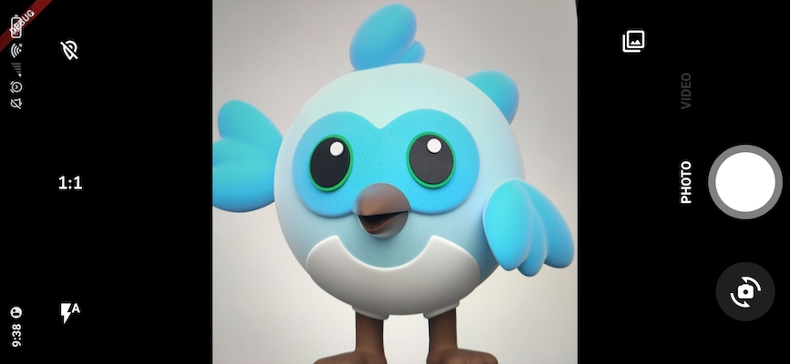
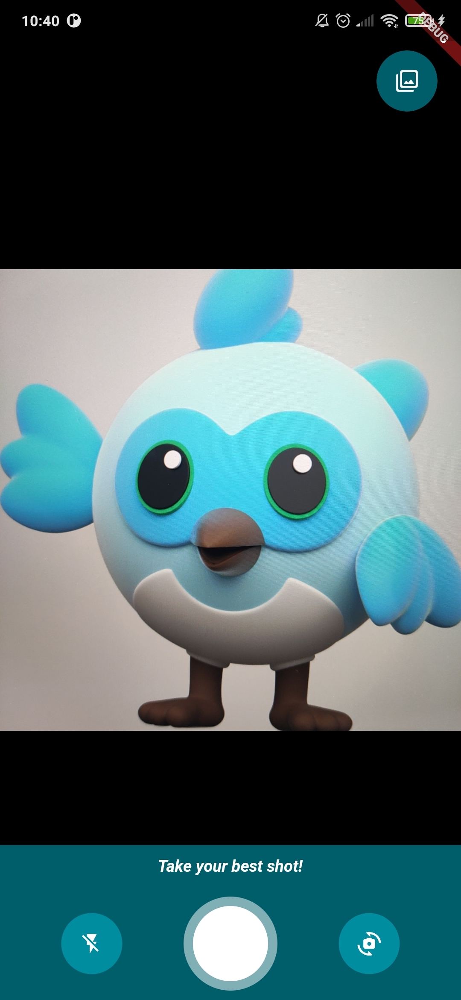
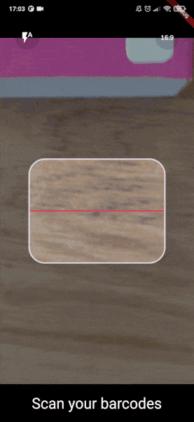

<a href="https://apparence.io">
  
</a>
<div style="margin-top:40px">
  
  
</div>

<a href="https://apparencekit.dev" style="margin-top:32px">
  
</a>

This plugin is also available as a template in
[ApparenceKit](https://apparencekit.dev).<br>

<br>

# CamerAwesome

<div>
    <a href="https://github.com/Solido/awesome-flutter">
        
    </a>
    <a href="https://github.com/Apparence-io/camera_awesome">
        
    </a>
    <a href="https://pub.dev/packages/camerawesome">
        
    </a>
</div>

[](https://github.com/Apparence-io/CamerAwesome/blob/master/README.md)
[](https://github.com/Apparence-io/CamerAwesome/blob/master/README.zh.md)

📸 Embedding a camera experience within your own app shouldn't be that hard.
<br> A flutter plugin to integrate awesome Android / iOS camera experience.<br>

<br>
This package provides you with a fully customizable camera experience that you can use within your app.<br>
Use our awesome built-in interface or customize it as you want.

---

<div style="margin-top:16px;margin-bottom:16px">
  <a href="https://docs.page/Apparence-io/camera_awesome" style="">
    
  </a>
</div>

## Migration guide

If you are migrating from version 1.x.x to 2.x.x, please read the
[migration guide](https://docs.page/Apparence-io/camera_awesome/migration_guides/from_1_to_2).

## Native features

Here's all native features that cameraAwesome provides to the flutter side.

| Features                                 | Android | iOS |
| :--------------------------------------- | :-----: | :-: |
| 🔖 Ask permissions                       |   ✅    | ✅  |
| 🎥 Record video                          |   ✅    | ✅  |
| 📹 Multi camera (🚧 BETA)                |   ✅    | ✅  |
| 🔈 Enable/disable audio                  |   ✅    | ✅  |
| 🎞 Take photos                            |   ✅    | ✅  |
| 🌆 Photo live filters                    |   ✅    | ✅  |
| 🌤 Exposure level                         |   ✅    | ✅  |
| 📡 Broadcast live image stream           |   ✅    | ✅  |
| 🧪 Image analysis (barcode scan & more.) |   ✅    | ✅  |
| 👁 Zoom                                   |   ✅    | ✅  |
| 📸 Device flash support                  |   ✅    | ✅  |
| ⌛️ Auto focus                            |   ✅    | ✅  |
| 📲 Live switching camera                 |   ✅    | ✅  |
| 😵‍💫 Camera rotation stream              |   ✅    | ✅  |
| 🤐 Background auto stop                  |   ✅    | ✅  |
| 🔀 Sensor type switching                 |   ⛔️    | ✅  |
| 🪞 Enable/disable front camera mirroring |   ✅    | ✅  |

---

## 📖&nbsp; Installation and usage

### Add the package in your `pubspec.yaml`

```yaml
dependencies:
  camerawesome: ^2.0.0-dev.1
  ...
```

### Platform specific setup

- **iOS**

Add these on `ios/Runner/Info.plist`:

```xml
<key>NSCameraUsageDescription</key>
<string>Your own description</string>

<key>NSMicrophoneUsageDescription</key>
<string>To enable microphone access when recording video</string>

<key>NSLocationWhenInUseUsageDescription</key>
<string>To enable GPS location access for Exif data</string>
```

- **Android**

Change the minimum SDK version to 21 (or higher) in `android/app/build.gradle`:

```
minSdkVersion 21
```

In order to be able to take pictures or record videos, you may need additional
permissions depending on the Android version and where you want to save them.
Read more about it in the
[official documentation](https://developer.android.com/training/data-storage).

> `WRITE_EXTERNAL_STORAGE` is not included in the plugin starting with version
> 1.4.0.

If you want to record videos with audio, add this permission to your
`AndroidManifest.xml`:

```xml
<manifest xmlns:android="http://schemas.android.com/apk/res/android"
        package="com.example.yourpackage">
  <uses-permission android:name="android.permission.RECORD_AUDIO" />

  <!-- Other declarations -->
</manifest>
```

You may also want to save location of your pictures in exif metadata. In this
case, add below permissions:

```xml
<manifest xmlns:android="http://schemas.android.com/apk/res/android"
  package="com.example.yourpackage">
  <uses-permission android:name="android.permission.ACCESS_FINE_LOCATION" />
  <uses-permission android:name="android.permission.ACCESS_COARSE_LOCATION" />

  <!-- Other declarations -->
</manifest>
```

<details>
<summary>⚠️ Overriding Android dependencies</summary>

Some of the dependencies used by CamerAwesome can be overriden if you have a
conflict. Change these variables to define which version you want to use:

```gradle
buildscript {
  ext.kotlin_version = '1.7.10'
  ext {
    // You can override these variables
    compileSdkVersion = 33
    minSdkVersion = 24 // 21 minimum
    playServicesLocationVersion = "20.0.0"
    exifInterfaceVersion = "1.3.4"
  }
  // ...
}
```

Only change these variables if you are sure of what you are doing.

For example, setting the Play Services Location version might help you when you
have conflicts with other plugins. The below line shows an example of these
conflicts:

```
java.lang.IncompatibleClassChangeError: Found interface com.google.android.gms.location.ActivityRecognitionClient, but class was expected
```

</details>

### Import the package in your Flutter app

```dart
import 'package:camerawesome/camerawesome_plugin.dart';
```

---

## 👌 Awesome built-in interface

Just use our builder. <br> That's all you need to create a complete camera
experience within your app.

```dart
CameraAwesomeBuilder.awesome(
  saveConfig: SaveConfig.photoAndVideo(),
  onMediaTap: (mediaCapture) {
    OpenFile.open(mediaCapture.filePath);
  },
),
```



This builder can be customized with various settings:

- A theme.
- Builders for each part of the screen.
- Initial camera setup.
- Preview positioning.
- Additional preview decoration.
- And much more!

Here is an example:



Check the
[full documentation](https://docs.page/Apparence-io/camera_awesome/getting_started/awesome-ui)
to learn more.

---

## 🎨 Creating a custom interface

If the `awesome()` factory is not enough, you can use `custom()` instead.

It provides a `builder` property that lets you create your own camera
experience. <br>

The camera preview will be visible behind what you will provide to the builder.

```dart
CameraAwesomeBuilder.custom(
  saveConfig: SaveConfig.photo(),
  builder: (state, previewSize, previewRect) {
    // create your interface here
  },
)
```

> See more in
> [documentation](https://docs.page/Apparence-io/camera_awesome/getting_started/custom-ui)

### Working with the custom builder

Here is the definition of our builder method.

```dart
typedef CameraLayoutBuilder = Widget Function(CameraState cameraState, PreviewSize previewSize, Rect previewRect);
```

<br>
The only thing you have access to manage the camera is the cameraState.<br>
Depending on which state is our camera experience you will have access to some different method. <br>
`previewSize` and `previewRect` might be used to position your UI around or on top of the camera preview.
<br>

#### How do CamerAwesome states work ?

Using the state you can do anything you need without having to think about the
camera flow<br><br>

- On app start we are in `PreparingCameraState`<br>
- Then depending on the initialCaptureMode you set you will be
  `PhotoCameraState` or `VideoCameraState`<br>
- Starting a video will push a `VideoRecordingCameraState`<br>
- Stopping the video will push back the `VideoCameraState`<br>
  <br> Also if you want to use some specific function you can use the when
  method so you can write like this.<br>

```dart
state.when(
  onPhotoMode: (photoState) => photoState.start(),
  onVideoMode: (videoState) => videoState.start(),
  onVideoRecordingMode: (videoState) => videoState.pause(),
);
```

> See more in
> [documentation](https://docs.page/Apparence-io/camera_awesome/getting_started/custom-ui)

<br>

---

## 🐝 Listen to picture or video event

Using the onMediaCaptureEvent you can listen to any media capture event and do
whatever you want with it.

```dart
onMediaCaptureEvent: (event) {
    switch ((event.status, event.isPicture, event.isVideo)) {
        case (MediaCaptureStatus.capturing, true, false):
            debugPrint('Capturing picture...');
        case (MediaCaptureStatus.success, true, false):
            event.captureRequest.when(
                single: (single) {
                debugPrint('Picture saved: ${single.file?.path}');
                },
                multiple: (multiple) {
                multiple.fileBySensor.forEach((key, value) {
                    debugPrint('multiple image taken: $key ${value?.path}');
                });
                },
            );
        case (MediaCaptureStatus.failure, true, false):
            debugPrint('Failed to capture picture: ${event.exception}');
        case (MediaCaptureStatus.capturing, false, true):
            debugPrint('Capturing video...');
        case (MediaCaptureStatus.success, false, true):
            event.captureRequest.when(
                single: (single) {
                    debugPrint('Video saved: ${single.file?.path}');
                },
                multiple: (multiple) {
                    multiple.fileBySensor.forEach((key, value) {
                        debugPrint('multiple video taken: $key ${value?.path}');
                    });
                },
            );
        case (MediaCaptureStatus.failure, false, true):
            debugPrint('Failed to capture video: ${event.exception}');
        default:
            debugPrint('Unknown event: $event');
    }
},
```

---

## 🔬 Analysis mode

Use this to achieve:

- QR-Code scanning.
- Facial recognition.
- AI object detection.
- Realtime video chats.
- And much more 🤩


You can check examples using MLKit inside the `example` directory. The above
example is from `ai_analysis_faces.dart`. It detects faces and draw their
contours.

It's also possible to use MLKit to read barcodes:



Check `ai_analysis_barcode.dart` and `preview_overlay_example.dart` for examples
or the
[documentation](https://docs.page/Apparence-io/camera_awesome/ai_with_mlkit/reading_barcodes).

### How to use it

```dart
CameraAwesomeBuilder.awesome(
  saveConfig: SaveConfig.photo(),
  onImageForAnalysis: analyzeImage,
  imageAnalysisConfig: AnalysisConfig(
        // Android specific options
        androidOptions: const AndroidAnalysisOptions.nv21(
            // Target width (CameraX will chose the closest resolution to this width)
            width: 250,
        ),
        // Wether to start automatically the analysis (true by default)
        autoStart: true,
        // Max frames per second, null for no limit (default)
        maxFramesPerSecond: 20,
    ),
)
```

> MLkit recommends using nv21 format for Android. <br> bgra8888 is the iOS
> format For machine learning you don't need full-resolution images (720 or
> lower should be enough and makes computation easier)

Learn more about the image analysis configuration in the
[documentation](https://docs.page/Apparence-io/camera_awesome/ai_with_mlkit/image_analysis_configuration)
.

Check also detailed explanations on how to use MLKit to
[read barcodes](https://docs.page/Apparence-io/camera_awesome/ai_with_mlkit/reading_barcodes)
and
[detect faces](https://docs.page/Apparence-io/camera_awesome/ai_with_mlkit/detecting_faces).

⚠️ On Android, some devices don't support video recording and image analysis at
the same time.

- If they don't, image analysis will be ignored.
- You can check if a device has this capability by using
  `CameraCharacteristics .isVideoRecordingAndImageAnalysisSupported(Sensors.back)`.

---

## 🐽 Updating Sensor configuration

Through state you can access to a `SensorConfig` class.

<br>

| Function               | Comment                                                    |
| ---------------------- | ---------------------------------------------------------- |
| `setZoom`              | change zoom                                                |
| `setFlashMode`         | change flash between NONE,ON,AUTO,ALWAYS                   |
| `setBrightness`        | change brightness level manually (better to let this auto) |
| `setMirrorFrontCamera` | set mirroring for front camera                             |

All of these configurations are listenable through a stream so your UI can
automatically get updated according to the actual configuration.

<br>

## 🌆 Photo live filters

Apply live filters to your pictures using the built-in interface:


You can also choose to use a specific filter from the start:

```dart
CameraAwesomeBuilder.awesome(
  // other params
  filter: AwesomeFilter.AddictiveRed,
  availableFilters: ...
)
```

Or set the filter programmatically:

```dart
CameraAwesomeBuilder.custom(
  builder: (cameraState, previewSize, previewRect) {
    return cameraState.when(
      onPreparingCamera: (state) =>
      const Center(child: CircularProgressIndicator()),
      onPhotoMode: (state) =>
          TakePhotoUI(state, onFilterTap: () {
            state.setFilter(AwesomeFilter.Sierra);
          }),
      onVideoMode: (state) => RecordVideoUI(state, recording: false),
      onVideoRecordingMode: (state) =>
          RecordVideoUI(state, recording: true),
    );
  },
)
```

See all available filters in the
[documentation](https://docs.page/Apparence-io/camera_awesome/widgets/awesome_filters).

> [!TIP] By default the awesome ui setup has a filter list but you can pass an
> empty list to remove it

## 📷 📷 Concurrent cameras


> 🚧 Feature in beta 🚧 Any feedback is welcome!

In order to start using CamerAwesome with multiple cameras simulatenously, you
need to define a `SensorConfig` that uses several sensors. You can use the
`SensorConfig.multiple()` constructor for this:

```dart
CameraAwesomeBuilder.awesome(
    sensorConfig: SensorConfig.multiple(
        sensors: [
            Sensor.position(SensorPosition.back),
            Sensor.position(SensorPosition.front),
        ],
        flashMode: FlashMode.auto,
        aspectRatio: CameraAspectRatios.ratio_16_9,
    ),
    // Other params
)
```

This feature is not supported by all devices and even when it is, there are
limitations that you must be aware of.

Check the details in the
[dedicated documentation](https://docs.page/Apparence-io/camera_awesome/getting_started/multicam).

<br>

<a href="https://apparence.io">
  
</a>
