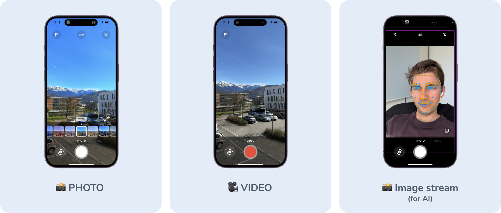

<a href="https://apparence.io">
    
</a>
<div style="margin-top:40px" >
    
    
</div>

<br/>

# CamerAwesome
📸 Embedding a camera experience within your own app should't be that hard. <br/>
A flutter plugin to integrate awesome Android / iOS camera experience.<br/>
<br/>
This packages provides you a fully customizable camera experience that you can use within your app.<br/>
Use our awesome built in interface or customize it as you want. 

--------

## Native features
Here's all native features that cameraAwesome provides to the flutter side.

| System                           | Android | iOS | 
|----------------------------------|---------|-----|
| 🔖 Ask permissions               | ✅      | ✅  |
| 🎥 Record video                  | ✅      | ✅  |
| 🔈 Enable/disable audio          | ✅      | ✅  |
| 🎞 Take picture                  | ✅      | ✅  |
| 🌤 Exposure level                | ✅      | ✅  |
| 📡 Broadcast live image stream   | ✅      | ✅  |
| 👁 zoom                          | ✅      | ✅  |
| 📸 Device flash support          | ✅      | ✅  |
| ⌛️ Auto focus                    | ✅      | ✅  |
| 📲 Live switching camera         | ✅      | ✅  |
| 😵‍💫 Camera rotation stream        | ✅      | ✅  |
| 🤐 Background auto stop          | ✅      | ✅  |

-----

## 👌 Awesome build-in interface

Just use our builder. <br>
That's all you need to create a complete camera experience within you app.
```dart
CameraAwesomeBuilder.awesome(
    initialCaptureMode: CaptureModes.PHOTO,
    picturePathBuilder: (captureMode) => _path(captureMode),
    videoPathBuilder: (captureMode) => _path(captureMode),
    onMediaTap: (mediaCapture) {
        OpenFile.open(mediaCapture.filePath);
    },
),
```
------
## 🎨 Creating a custom interface

Our builder provides a custom factory. <br>
Now you have access to the builder property and can create your own camera experience. <br>
The camera preview will be visible behind what you will provide to our builder.

> Note <br/>
> Only the camera preview is not customizable yet

```dart
CameraAwesomeBuilder.custom(
    initialCaptureMode: CaptureModes.PHOTO,
    picturePathBuilder: (captureMode) => _path(captureMode),
    videoPathBuilder: (captureMode) => _path(captureMode),
    builder: (state) {
        // create your interface here 
    },
),
```

### Working with the custom builder

Here is the definition of our builder method. 
```dart
typedef CameraLayoutBuilder = Widget Function(CameraState cameraState);
```
<br/>
The only thing you have access is the cameraState.<br/>
Depending on which state is our camera experience you will have access to some different method. <br/>
<br/>

#### How camerAwesome states works ? 
Using the state you can do anything you need without having to think about the camera flow<br/><br/>
- On app start we are in [PreparingCameraState]<br/>
- Then depending on the initialCaptureMode you set you will be [PictureCameraState] or [VideoCameraState]<br/>
- Starting a video will push a [VideoRecordingCameraState]<br/>
- Stopping the video will push back the [VideoCameraState]<br/>
<br/>
Also if you want to use some specific function you can use the when method so you can write like this.<br/>

```dart
state.when(
    onPictureMode: (pictureState) => pictureState.start(),
    onVideoMode: (videoState) => videoState.start(),
    onVideoRecordingMode: (videoState) => videoState.pause(),
);
```

<br/>

-----
## 🔬 Analysis mode (WIP 🚧)

This is a first step into this feature as we are currently working on this.
<br/>
<br/>

Use this to achieve
- QR-Code scanning
- facial recognition
- AI object detection 
- realtime video chats

-----
## 🐽 Setting sensors settings
Through state you can access to a ```SensorConfig``` class. 
This contains 
| Function   | Comment |
|------------------------------------|---------|
| setZoom    | changing zoom |
| setFlashMode    | changing flash between NONE,ON,AUTO,ALWAYS |
| setBrightness    | change brightness level manually (better to let this auto) |

All of this configurations are listenable through a stream so your UI can automatically get updated according to the actual configuration.


-------
## 🚀 Roadmap

- [ ] bind exif preferences (flutter)
- [ ] create complete documentation for all use cases (docs.page)
- [ ] Tests plugin flutter states (flutter)
- [ ] Tests E2E (flutter)
- [ ] Handle rotation (flutter)
- [ ] Image analysis state (flutter)
- [ ] Apply Preview filter 
- [ ] Apply filter on image
- [ ] Timer before picture (flutter)
- [ ] include cameraX extensions (https://github.com/android/camera-samples/tree/main/CameraXExtensions)
